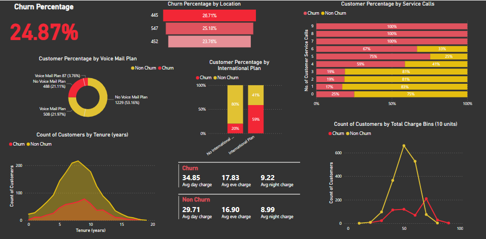

# Telco Customer Churn

## Introduction

Customer churn is the loss of customers by a business for different reasons such as poor service and better price somewhere else. It is one of the most critical and challenging problems for telecommunication companies, credit card companies, cable service providers, etc. Since acquiring new customers costs more than retaining existing ones, analysing customer churn is vital for businesses.

The goal of this project was to analyse the given dataset and derive valuable insights that would be useful to make strategic decisions to improve customer retention. Folllowing that a churn prediction model was also built.

<!-- create a virtual environment: -
In the vscode terminal, give the following commands: -
  py -3 -m pip install virtualenv
  py -3 -m venv venv
  venv\Scripts\activate
Then install the following dependencies (using pip install or pip3 install): - 
  pandas 
  sklearn 
  joblib 
  flask 
  xgboost 
However if xgboost installation fails, then first install pipwin and use that to install xgboost: - 
  pip install pipwin 
  pipwin install xgBoost -->

## Dashboard

The insights obtained through the elaborate analysis of the customer churn dataset were presented using a Power BI dashboard. A glimpse of that dashboard: 

